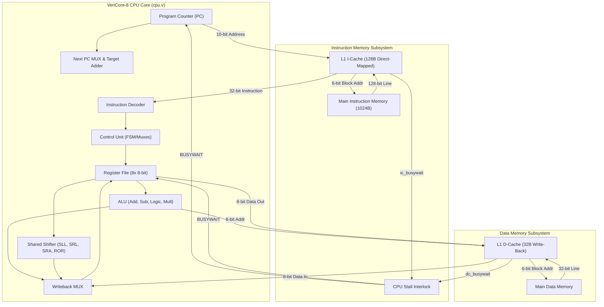

# ⚡ VeriCore-8: 8-Bit RISC CPU with Split L1 Caches & Hardware Multiplier

[](https://en.wikipedia.org/wiki/Verilog)
[](http://iverilog.icarus.com/)
[]()
[](LICENSE)

A complete, cycle-accurate **8-bit RISC microprocessor** implemented in synthesizable **Verilog HDL**, featuring a Harvard architecture with independent **L1 Instruction & Data Caches**, multi-cycle memory interfaces, a dedicated barrel/rotate shifter, an 8-bit array multiplier, and a custom **C-based assembly toolchain**.

---

## 📑 Table of Contents
- [Architecture Overview](#-architecture-overview)
- [System Architecture Diagram](#-system-architecture-diagram)
- [Instruction Set Architecture (ISA)](#-instruction-set-architecture-isa)
- [Cache & Memory Hierarchy](#-cache--memory-hierarchy)
  - [L1 Instruction Cache (I-Cache)](#1-l1-instruction-cache-icachev)
  - [L1 Data Cache (D-Cache)](#2-l1-data-cache-dcachev)
  - [CPU Stall Arbitration](#3-cpu-stall-arbitration)
- [ALU & Execution Units](#-alu--execution-units)
- [Software Toolchain & Custom Assembler](#-software-toolchain--custom-assembler)
- [Verification & Benchmark Programs](#-verification--benchmark-programs)
- [Getting Started & Simulation Guide](#-getting-started--simulation-guide)
- [Directory Structure](#-directory-structure)

---

## 🏛 Architecture Overview

VeriCore-8 implements a single-cycle execution datapath augmented with stall-interlock mechanisms for memory hierarchy latency. Key architectural features include:

- **Word & Data Width**: 8-bit datapath and data memory addressing; 32-bit fixed-length instruction format for dense, orthogonal encoding.
- **Register File**: 8 general-purpose 8-bit registers (`R0` through `R7`) with dual asynchronous read ports and a single synchronous write-back port protected by stall detection.
- **Harvard Memory Architecture**: Physically separated instruction and data memory paths avoiding structural bus contention.
- **Two-Level Memory Hierarchy**:
  - **L1 Instruction Cache**: 128-byte direct-mapped read-only cache (8 lines × 16-byte blocks) backed by a 1KB main instruction ROM.
  - **L1 Data Cache**: 32-byte direct-mapped write-back/write-allocate cache (8 lines × 4-byte blocks) with dirty-bit tracking.
- **Branch & Jump Engine**: Dedicated target adder supporting PC-relative branches (`BEQ`, `BNE`) and unconditional direct jumps (`J`) without stealing cycles from the main ALU.
- **Hardware Multiply & Shift Engine**: Array partial-product 8-bit multiplier and a multi-mode shared shift unit (logical left/right, arithmetic right, rotate right).

---

## 🖼 System Architecture Diagram



---

## 📜 Instruction Set Architecture (ISA)

VeriCore-8 uses a fixed 32-bit instruction format divided into 4 byte-aligned fields:

```
 31             24 23             16 15              8 7              0
+-----------------+-----------------+-----------------+-----------------+
|   OPCODE [7:0]  |  DEST / OFFSET  |   SRC 1 (RT)    |  SRC 2 / IMM    |
+-----------------+-----------------+-----------------+-----------------+
```

### Supported Instructions

| Mnemonic | Opcode (Hex) | Type | Syntax | RTL Operation | Description |
|:---|:---:|:---:|:---|:---|:---|
| `loadi` | `0x00` | I-Type | `loadi Rd, IMM` | `R[Rd] = IMM` | Load 8-bit immediate value |
| `mov`   | `0x01` | R-Type | `mov Rd, Rs` | `R[Rd] = R[Rs]` | Register-to-register copy |
| `add`   | `0x02` | R-Type | `add Rd, Rs, Rt` | `R[Rd] = R[Rs] + R[Rt]` | 8-bit 2's complement addition |
| `sub`   | `0x03` | R-Type | `sub Rd, Rs, Rt` | `R[Rd] = R[Rs] - R[Rt]` | Subtraction via internal 2's complement |
| `and`   | `0x04` | R-Type | `and Rd, Rs, Rt` | `R[Rd] = R[Rs] & R[Rt]` | Bitwise logical AND |
| `or`    | `0x05` | R-Type | `or Rd, Rs, Rt` | `R[Rd] = R[Rs] \| R[Rt]`| Bitwise logical OR |
| `j`     | `0x06` | J-Type | `j OFFSET` | `PC = (PC+4) + (OFFSET<<2)` | Unconditional branch / jump |
| `beq`   | `0x07` | B-Type | `beq OFFSET, Rs, Rt` | `if (Rs == Rt) PC += (OFFSET<<2)` | Branch if Equal |
| `bne`   | `0x0C` | B-Type | `bne OFFSET, Rs, Rt` | `if (Rs != Rt) PC += (OFFSET<<2)` | Branch if Not Equal |
| `sll`   | `0x0D` | S-Type | `sll Rd, Rs, shamt` | `R[Rd] = R[Rs] << shamt` | Shift Left Logical |
| `srl`   | `0x0E` | S-Type | `srl Rd, Rs, shamt` | `R[Rd] = R[Rs] >> shamt` | Shift Right Logical (zero fill) |
| `sra`   | `0x0F` | S-Type | `sra Rd, Rs, shamt` | `R[Rd] = R[Rs] >>> shamt` | Shift Right Arithmetic (sign preserved) |
| `ror`   | `0x10` | S-Type | `ror Rd, Rs, shamt` | `R[Rd] = rot_right(R[Rs], shamt)`| Circular Rotate Right |
| `mult`  | `0x11` | R-Type | `mult Rd, Rs, Rt`| `R[Rd] = R[Rs] * R[Rt]` | 8-bit unsigned hardware multiplication |
| `lwd`   | `0x08` | M-Type | `lwd Rd, Rs` | `R[Rd] = Mem[R[Rs]]` | Load word from data memory |
| `swd`   | `0x0A` | M-Type | `swd Rs, Rd` | `Mem[R[Rd]] = R[Rs]` | Store word into data memory |

---

## 💾 Cache & Memory Hierarchy

### 1. L1 Instruction Cache (`icache.v`)
- **Capacity**: 128 Bytes (8 cache lines × 16 Bytes per block = 4 instructions/line).
- **Design**: Direct-mapped, read-only with synchronous tag/valid arrays and asynchronous block extraction.
- **Address Breakdown**:
  ```
   9        7 6      4 3        2 1        0
  +----------+---------+---------+----------+
  |   TAG    |  INDEX  | WORD_SEL|  UNUSED  |
  +----------+---------+---------+----------+
    (3 bits)   (3 bits)  (2 bits)  (2 bits)
  ```
- **Controller FSM**:
  - `IDLE (00)`: Evaluates hit/miss in combinational logic (`#0.9ns` tag check). On miss, asserts `busywait` and transitions to `MEM_READ`.
  - `MEM_READ (01)`: Initiates multi-word block read request from 1024B instruction memory until `imem_busywait` clears.
  - `CACHE_UPDATE (10)`: Updates cache block and tag array, sets valid bit, and returns to `IDLE`.

### 2. L1 Data Cache (`dcache.v`)
- **Capacity**: 32 Bytes (8 cache lines × 4 Bytes per block).
- **Design**: Direct-mapped with write-back and write-allocate policy to minimize memory traffic.
- **Address Breakdown**:
  ```
   7        5 4      2 1        0
  +----------+---------+----------+
  |   TAG    |  INDEX  |  OFFSET  |
  +----------+---------+----------+
    (3 bits)   (3 bits)  (2 bits)
  ```
- **State Machine**:
  - `IDLE`: Serves read/write hits in 1 cycle. If a miss occurs on a **clean line**, enters `MEM_READ`. If a miss occurs on a **dirty line**, flushes old block via `MEM_WRITE` before issuing read.
  - `MEM_WRITE`: Writes dirty 32-bit block to main memory.
  - `MEM_READ`: Fetches requested 32-bit block.
  - `CACHE_UPDATE`: Updates line data, adjusts dirty flag, and completes CPU operation.

### 3. CPU Stall Arbitration
```verilog
assign cpu_busywait = ic_busywait | dc_busywait;
```
When either cache controller encounters a miss, the `BUSYWAIT` signal asserts:
1. Freezes the Program Counter (`PC <= PC`).
2. Disables register file write-enable gating (`safe_write_enable = WRITEENABLE & ~BUSYWAIT`).
3. Holds the pipeline in a slip state until data is resolved, eliminating hazards.

---

## ⚙ ALU & Execution Units

The ALU (`alu.v`) uses a modular design featuring parallel functional units selected through an 8-to-1 operational multiplexer:

1. **Adder / Subtractor**: Subtraction is computed via hardware 2's complement inversion (`~B + 1`) routed through the addition unit, minimizing gate overhead.
2. **Dedicated Shift Unit (`shift_unit.v`)**: Implements `SLL`, `SRL`, `SRA`, and `ROR` in a single shared module with a unified operand decoder.
3. **Array Multiplier (`mult_unit`)**: 8-bit unsigned multiplier summing 8 partial products with simulated combinational delay modeling real-world propagation.
4. **Zero Detection Flag (`ZERO`)**: Evaluated instantaneously to trigger conditional control hazards (`BEQ`, `BNE`).

---

## 🛠 Software Toolchain & Custom Assembler

The repository includes a standalone C-based assembler (`CO2070Assembler.c`) and utility scripts for converting human-readable assembly syntax into executable machine memory images:

```
 Assembly (.s) 
     │
     ▼ [CO2070Assembler.c]
 Machine Code (.machine - 32-bit binary strings)
     │
     ▼ [generate_memory_image.sh]
 Verilog Hex/Binary Memory Image (.mem)
     │
     ▼ [$readmemb in instruction_memory.v]
 Cycle-accurate Simulation
```

### Compiling and Assembling:
```bash
# 1. Compile the assembler
gcc CO2070Assembler.c -o CO2070Assembler

# 2. Assemble your program
./CO2070Assembler sample_program.s

# 3. Format as a memory image for Verilog simulation
./generate_memory_image.sh sample_program.s
mv instr_mem.mem sample_program.mem
```

---

## 🧪 Verification & Benchmark Programs

The processor design has been verified against rigorous synthetic programs:

1. **`Fibonacci.s`**:
   - Calculates the first 10 terms of the Fibonacci sequence ($F_0$ through $F_9$).
   - Sequentially stores terms to Data Memory locations `0x00`–`0x09` via `swd`, verifying register file updates, loops, backward branches, and write-back cache operation.
2. **`icache_test.s`**:
   - Instruction cache stress test exercising compulsory misses across blocks 0, 1, and 2.
   - Executes jumps between memory blocks aliased to identical cache indices (forcing thrashing and conflict misses) to validate eviction and re-fetch behavior.
3. **`sample_program.s`**:
   - Exhaustive ISA validation covering every ALU operation, shifting mode, multi-cycle multiplication, and PC branch boundary edge cases.

---

## 🚀 Getting Started & Simulation Guide

### Prerequisites
- [Icarus Verilog](http://iverilog.icarus.com/) (`iverilog` & `vvp`)
- [GTKWave](http://gtkwave.sourceforge.net/) (for inspecting timing diagrams)
- GCC (optional, for assembler compilation)

### Running Simulation
```bash
# Clone the repository
git clone https://github.com/<your-username>/VeriCore-8.git
cd VeriCore-8

# Compile testbench and hardware modules
iverilog -o cpu_sim cpu_tb.v cpu.v icache.v instruction_memory.v dcache.v data_memory.v alu.v reg_file.v shift_unit.v

# Execute simulation
vvp cpu_sim
```

### Inspecting Waveforms
Simulation generates a comprehensive Value Change Dump (`cpu_wavedata.vcd`). Inspect all control signals, register values, and cache FSM states:
```bash
gtkwave cpu_wavedata.vcd &
```

---

## 📂 Directory Structure

```text
├── alu.v                    # Arithmetic Logic Unit and Multiplier Module
├── cpu.v                    # Core datapath, instruction decoder, and control logic
├── cpu_tb.v                 # Top-level system integration testbench
├── dcache.v                 # L1 Direct-Mapped Write-Back Data Cache
├── icache.v                 # L1 Direct-Mapped Read-Only Instruction Cache
├── data_memory.v            # Byte-addressable Main Data Memory
├── instruction_memory.v     # Block-addressable Main Instruction Memory
├── reg_file.v               # 8x 8-bit Dual-Read Synchronous Register File
├── shift_unit.v             # Barrel / Arithmetic / Logical / Rotate Shifter
├── CO2070Assembler.c        # Custom C-based Assembly-to-Machine-Code tool
├── generate_memory_image.sh # Script to format assembly output for $readmemb
├── Fibonacci.s              # Fibonacci sequence benchmark algorithm
├── sample_program.s         # Full ISA validation suite
├── icache_test.s            # Cache thrashing and conflict miss test suite
└── README.md                # Project documentation
```

---

## 👨‍💻 Authors & Acknowledgments

- **Department of Computer Engineering, University of Peradeniya**
- Developed as part of the **CO2070: Computer Architecture** series.
- Designed & Verified by **E/22/159** & **E/22/004**.
